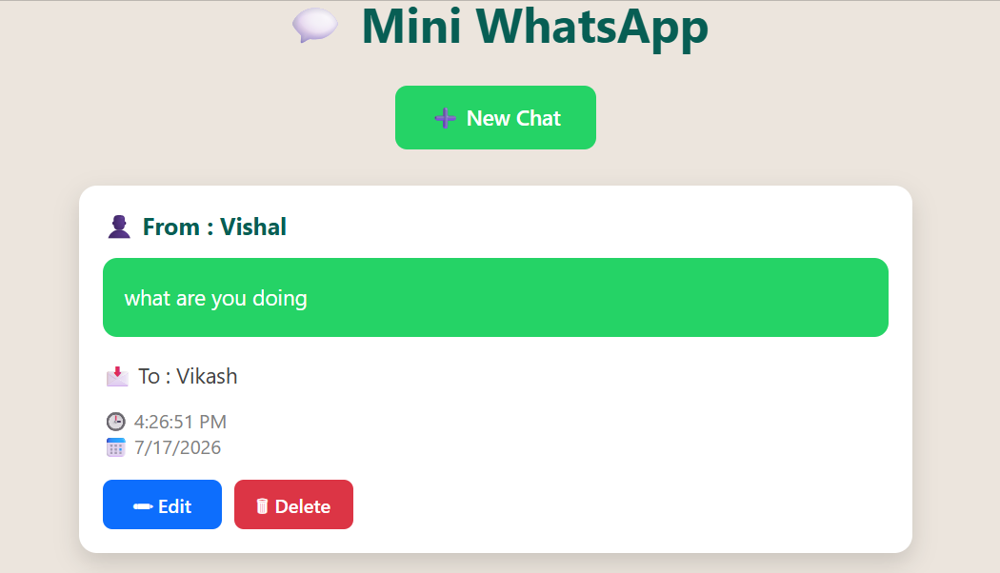
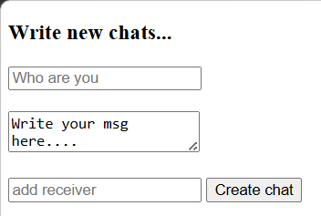
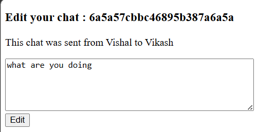

# 💬 Mini WhatsApp

A simple WhatsApp CRUD application built using **Node.js, Express.js, MongoDB Atlas, Mongoose, and EJS**.

## 🚀 Live Demo

https://mini-whatsapp-ibdf.onrender.com/chats

## 📸 Screenshots

### 🏠 Home Page



### ➕ New Chat



### ✏️ Edit Chat



## ✨ Features

- Create Chat
- Read Chats
- Update Chat
- Delete Chat
- MongoDB Atlas Database
- Responsive UI

## 🛠️ Tech Stack

- HTML
- CSS
- JavaScript
- Node.js
- Express.js
- MongoDB Atlas
- Mongoose
- EJS
- Git & GitHub
- Render

## ▶️ Installation

```bash
git clone https://github.com/vishnuc100/Mini_whatsapp.git
cd Mini_whatsapp
npm install
```

Create a `.env` file:

```env
MONGO_URL=your_mongodb_connection_string
```

Run the project:

```bash
node app.js
```

Open in browser:

```
http://localhost:8080/chats
```

## 👨‍💻 Author

**Vishnu Choudhary**